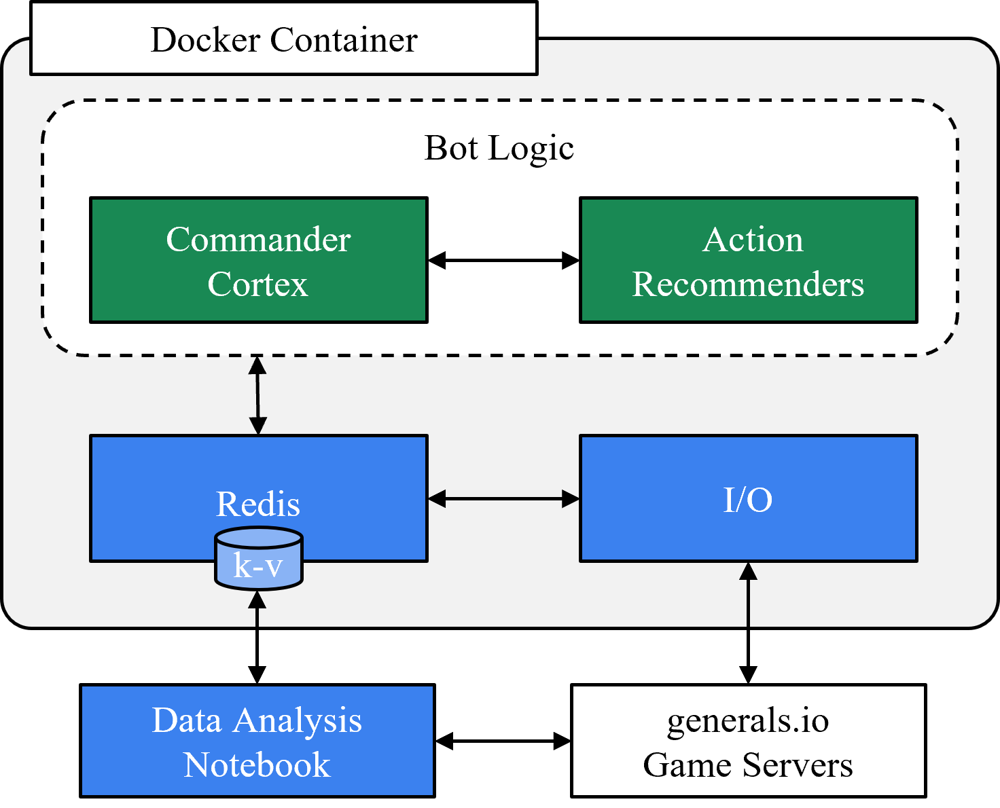
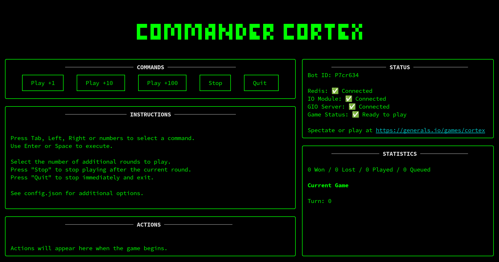

# Generally Genius (GG) Bot Framework

[Generals.io (GIO)](https://generals.io/) is a fast-paced real-time strategy game with imperfect information within a 2D grid world. Players expand their land and battle with enemies in attempt to capture each others' generals. Capturing an opponent's general gives a player full control of their territory.

GIO presents an excellent testbed for AI agents through its simple set of action (up, down, left, right) in a complex state space. A gameplay supports up to 12 players, which makes it particularly challenging to select an appropriate strategy.

We present an agent development and data collection framework for GIO:
- highly modular framework using [microservices architecture](https://microservices.io/)
- language agnostic - use anything with a [Redis client](https://redis.io/resources/clients/)
- supports rapid development and testing of AI agents
- uses [Redis](https://redis.io/) message broker for all communication
- enables real-time data collection and analysis of agent performance
- includes example notebooks ([here](gg-analysis.ipynb) and [DeepNote](https://deepnote.com/workspace/insights-island-2232debf-8efe-49d0-80d9-20d155a36301/project/generalsio-analysis-51d1567e-7054-4223-9aa2-98354e1dc291/notebook/fetch-and-plot-f69012bef9f04e27aae6a600cd811276)) for interactive data analysis

## Components

- [CommanderCortex](https://github.com/CorsairCoalition/CommanderCortex) - UI to control and monitor bots
- [SergeantSocket](https://github.com/CorsairCoalition/SergeantSocket) - IO module to relay data between game server and backend
- [ArmadaAssault](https://github.com/CorsairCoalition/ArmadaAssault) - bot components that generate action recommendations
- [StrategySentinal](https://github.com/CorsairCoalition/StrategySentinal) - bot component that selects appropriate action
- [ReplayRanger](https://github.com/CorsairCoalition/ReplayRanger) -  replay GIO game events on Redis for bot development
- [Flobot](https://github.com/CorsairCoalition/Flobot) - highly capable bot that serves as a baseline adversary for testing

### Architecture



### Screenshot



## Prerequisites

- [Docker](https://docs.docker.com/engine/install)
- [Docker Compose](https://docs.docker.com/compose/install)

Use the following commands to test:

```sh
$ docker version
$ docker compose version
```

## Setup

1. Clone or download this repository.

2. Make a copy of the example configuration file, `config.json.example` and change the `userId`, `username`, and other variables as desired.

```sh
$ cp config.json.example config.json
$ sed -i "s/RANDOMLY_GENERATED_STRING/$(openssl rand -base64 12)/" config.json
```

3. Run background services. This command will start Docker containers for the framework components: [SergeantSocket](https://github.com/CorsairCoalition/SergeantSocket), [ArmadaAssault](https://github.com/CorsairCoalition/ArmadaAssault), [Redis](https://redis.io/).

```sh
$ docker compose up
```

4. Ignore the Redis-related warnings. When you see "READY TO PLAY", continue to the next step.

5. Open another terminal window and navigate to the same directory.

6. Execute the following command:

```sh
$ docker compose run commander-cortex
```

The Commander Cortex UI should appear. You are now ready to play against other bots or humans.

## Development

1. Get the component that you want to modify and place it in the same directory.
2. Edit `docker-compose.yaml` - replace `image:` with `build:`.
3. Make desired changes and build a fresh image using `docker compose build`.

See [GIO developer documentation](https://dev.generals.io/).

## Testing

- Use the [GIO bot server](https://bot.generals.io/) to create custom games.
- Human against [Flobot](https://github.com/CorsairCoalition/Flobot) (1x speed) - [custom game: floatbot](https://bot.generals.io/games/floatbot)
- Bot against [Flobot](https://github.com/CorsairCoalition/Flobot) (4x speed) - [custom game: cortex](https://bot.generals.io/games/cortex)

## Gameplay Analysis

See [gg-analysis.ipynb](gg-analysis.ipynb) for further details.

## Support

- [Discord: generals.io](https://discord.com/invite/QP63V5Y) -> #botting
